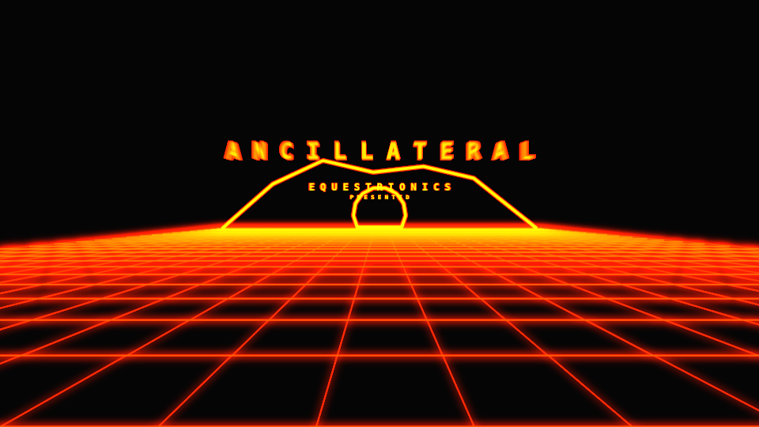

# `A N C I L L A T E R A L // E Q U E S T R I O N I C S`

Entry in the Combined 4k/64k Intro competition at Solskogen 2019.

Online version available [here](https://mollerse.github.io/solskogen-19/packed.html).

Submitted version was `2808` bytes, minified and compressed.

You can find the source in `index.js`. Not a whole lot of golfing going on there.

Due to time constraints (promise I'll start earlier next year) the prod was submitted without any music. Adding the intended player (soundbox) pushed me over the budget without time to do aditional golfing (lesson learned).

But I made a for-fun version with a sample from soundbox that gives a hint at what could have been. You can watch that [here](https://mollerse.github.io/solskogen-19/packed.html).
